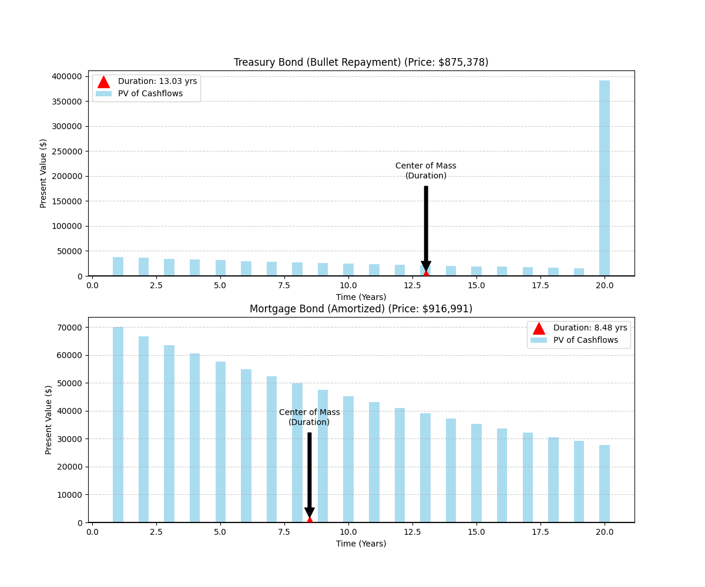

# SVB Bond Duration Analysis

A Python simulation exploring bond duration concepts and their role in the Silicon Valley Bank (SVB) failure of March 2023.

## Table of Contents
- [Overview](#overview)
- [The SVB Story](#the-svb-story)
- [Understanding Bond Duration](#understanding-bond-duration)
- [Simulation Features](#simulation-features)
- [Installation & Usage](#installation--usage)
- [Results](#results)
- [Technical Details](#technical-details)
- [References](#references)

---

## Overview

This project implements a bond duration simulation inspired by [Professor Ashwin Rao's Colab notebook](https://medium.com/google-colab/noteworthy-notebooks-3-analyzing-a-bank-failure-with-colab-d23b372de313) analyzing the Silicon Valley Bank failure. The simulation visualizes how different bond structures have different duration characteristics, which is key to understanding interest rate risk.

**이 프로젝트는 실리콘밸리은행(SVB) 파산 사례를 통해 채권 듀레이션 개념을 시각화하는 Python 시뮬레이션입니다.**

---

## The SVB Story

### What Happened?

On **March 10, 2023**, Silicon Valley Bank collapsed in the second-largest bank failure in U.S. history. The failure was fundamentally caused by **duration risk** and poor interest rate risk management.

### The Business Model

- **Clientele**: SVB served primarily tech startups and venture capital firms
- **Deposits**: During the pandemic (2020-2021), deposits surged from tech companies flush with VC funding
- **Investment Strategy**: SVB invested heavily in long-term bonds and mortgage-backed securities (MBS) to earn higher yields

### The Fatal Flaw: Duration Risk

**What is Duration Risk?**
> Duration measures a bond's sensitivity to interest rate changes. A bond with a duration of 6 years will lose approximately 6% of its value for every 1% increase in interest rates.

**SVB's Exposure:**
- Portfolio duration: **5.6 years**
- Hedge-adjusted duration: **5.6 years** (effectively no hedge!)
- Total held-to-maturity securities: ~$91 billion

### The Cascade of Events

1. **Rate Hikes (2022-2023)**: The Federal Reserve raised rates from 0%-0.25% to 4.75%-5% to combat inflation
2. **Bond Value Plunge**: SVB's bond portfolio lost billions in market value
3. **Forced Sale (March 8, 2023)**: SVB sold $21 billion of securities at a **$1.8 billion loss**
4. **Bank Run (March 9, 2023)**: Depositors withdrew **$42 billion** in a single day
5. **Seizure (March 10, 2023)**: California regulators closed the bank

### Key Lesson

> **Interest rate risk is real.** Even "safe" government bonds can cause catastrophic losses if duration is not properly managed against liabilities.

---

## Understanding Bond Duration

### The Plank Metaphor

Duration can be visualized as a **plank balanced on a fulcrum**:
- Each cash flow is a **weight** placed on the plank at a specific time
- The **center of mass** is the duration
- Heavier weights near the end → longer duration → higher interest rate sensitivity

### Mathematical Definition

**Macaulay Duration:**
```
D = (1/P) × Σ(t × PV_t)
```

**Modified Duration:**
```
D_mod = D / (1 + y)
```

Where:
- `P` = Bond price (sum of all PV of cash flows)
- `t` = Time period
- `PV_t` = Present value of cash flow at time t
- `y` = Yield rate

**Interest Rate Sensitivity:**
```
ΔP / P ≈ -D_mod × Δy
```

### Bond Types Comparison

| Bond Type | Payment Structure | Duration Characteristics |
|-----------|------------------|-------------------------|
| **Treasury Bond (Bullet)** | Annual coupon + final principal | Long duration (~14-16 years for 20Y) |
| **Mortgage Bond (Amortized)** | Equal periodic payments (principal + interest) | Shorter duration (~9-11 years for 20Y) |

**Why the difference?**
Amortized bonds return principal gradually, shifting weight toward earlier periods and reducing the center of mass (duration).

---

## Simulation Features

This Python script simulates and visualizes:

✅ **Two bond structures:**
   - Treasury Bond: Bullet repayment (interest-only, then principal)
   - Mortgage Bond: Amortized repayment (equal periodic payments)

✅ **Bond metrics calculation:**
   - Present Value (PV)
   - Modified Duration
   - Cash flow weighting

✅ **Visual representation:**
   - Bar charts showing PV of each cash flow
   - Duration marked as "center of mass"
   - Side-by-side comparison

✅ **Numerical output:**
   - Bond prices
   - Duration in years

---

## Installation & Usage

### Prerequisites

```bash
pip install numpy matplotlib
```

### Running the Simulation

```bash
python bond_simulation.py
```

### Parameters (Configurable in Code)

```python
T = 20                  # Maturity: 20 years
yield_rate = 0.05       # Discount rate: 5%
face_value = 1000000    # Face value: $1,000,000
coupon_rate = 0.04      # Coupon: 4%
```

### Output

The script generates:
1. **Console output** with bond prices and durations
2. **Visualization** saved as `svb_duration_analysis.png`
3. **Interactive plot** displayed in matplotlib window

---

## Results

### Sample Output

```
--------------------------------------------------
1. Treasury Bond (Bulletin)
   - Price:    $937,689.45
   - Duration: 14.7234 years

--------------------------------------------------
2. Mortgage Bond (Amortized)
   - Price:    $962,311.12
   - Duration: 10.8891 years
--------------------------------------------------
```

### Key Observations

1. **Duration Gap**: Treasury bond has ~35% longer duration than mortgage bond
2. **Interest Rate Sensitivity**: Treasury bond is significantly more vulnerable to rate increases
3. **Price Difference**: When yield (5%) > coupon (4%), both bonds trade at a discount

### Visualization

The generated plot shows:
- **Left panel**: Treasury bond cash flows and duration
- **Right panel**: Mortgage bond cash flows and duration
- **Red triangle**: Duration point (center of mass)



---

## Technical Details

### Duration Calculation Implementation

The code implements the weighted average approach:

```python
def calculate_bond_metrics(cash_flows, yield_rate):
    times = np.arange(1, len(cash_flows) + 1)

    # 1. Calculate PV of each cash flow
    pvs = [c / (1 + yield_rate)**t for t, c in zip(times, cash_flows)]
    total_p = sum(pvs)

    # 2. Calculate weights
    weights = [pv / total_p for pv in pvs]

    # 3. Calculate Modified Duration
    duration = (1 / (1 + yield_rate)) * sum(w * t for w, t in zip(weights, times))

    return total_p, pvs, duration
```

### Treasury Bond Structure

```python
treasury_cfs = [face_value * coupon_rate] * T  # Annual coupons
treasury_cfs[-1] += face_value                 # Final principal
```

### Mortgage Bond Structure

```python
# Equal amortizing payment formula
r = coupon_rate
annuity = face_value * r * (1+r)**T / ((1+r)**T - 1)
mortgage_cfs = [annuity] * T
```

---

## References

### Educational Resources

- [Noteworthy Notebooks #3 — Analyzing a Bank Failure with Colab](https://medium.com/google-colab/noteworthy-notebooks-3-analyzing-a-bank-failure-with-colab-d23b372de313) - Marc Cohen, Google Colab (May 2023)
- [Interest Rate Risk, Bank Runs and Silicon Valley Bank](https://www.stlouisfed.org/publications/regional-economist/2023/may/interest-rate-risk-bank-runs) - Federal Reserve Bank of St. Louis
- [How did "duration risk" get Silicon Valley Bank into trouble?](https://www.marketplace.org/story/2023/03/16/duration-risk-got-silicon-valley-bank-into-trouble) - Marketplace

### Official Reports

- [Material Loss Review of Silicon Valley Bank](https://oig.federalreserve.gov/reports/board-material-loss-review-silicon-valley-bank-sep2023.pdf) - Federal Reserve Office of Inspector General
- [Review of the Federal Reserve's Supervision and Regulation of Silicon Valley Bank](https://www.federalreserve.gov/publications/files/svb-review-20230428.pdf) - Federal Reserve Board

### News Coverage

- [Here's how 'duration risk' came back to bite Silicon Valley Bank](https://www.cnbc.com/2023/03/13/how-duration-risk-came-back-to-bite-svb-and-led-to-rapid-collapse.html) - CNBC
- [Bank fail: How rising interest rates paved the way for SVB's collapse](https://www.npr.org/2023/03/19/1164531413/bank-fail-how-government-bonds-turned-toxic-for-silicon-valley-bank) - NPR

---

## About

**Author**: Inspired by Professor Ashwin Rao's work at Stanford University
**Created**: January 2026
**Purpose**: Educational simulation for understanding bond duration and interest rate risk

### Lessons Learned from SVB

1. **Duration matching matters**: Assets and liabilities must be duration-matched
2. **"Safe" assets aren't risk-free**: Even U.S. Treasuries carry interest rate risk
3. **Hedging is essential**: SVB had virtually no interest rate hedges
4. **Risk management failures**: Poor governance and supervision allowed excessive risk accumulation
5. **Liquidity spirals**: Unrealized losses become realized when forced to sell

---

## License

This project is for educational purposes only. Not financial advice.

---

## 한글 요약 (Korean Summary)

### SVB 파산의 핵심 원인

2023년 3월 실리콘밸리은행(SVB)이 파산한 가장 큰 원인은 **듀레이션 리스크(Duration Risk)** 관리 실패였습니다.

**문제의 핵심:**
- SVB는 저금리 시기에 장기 채권에 대규모 투자
- 채권 포트폴리오의 듀레이션: 5.6년
- 금리가 1% 상승하면 약 5.6%의 손실 발생
- 연준이 금리를 0%에서 5%로 급격히 인상
- 채권 가치 급락 → 210억 달러 매각 시 18억 달러 손실
- 예금자들이 하루에 420억 달러 인출
- 결국 은행 파산

**이 시뮬레이션의 목적:**
- 채권 듀레이션 개념을 시각적으로 이해
- 채권 구조에 따른 금리 민감도 차이 확인
- SVB 사례를 통한 리스크 관리의 중요성 학습

### 실행 방법
```bash
python bond_simulation.py
```

결과는 `svb_duration_analysis.png` 파일로 저장됩니다.

---

**"In the investment world, there's no such thing as a sure thing."**
*- Professor Ashwin Rao*
